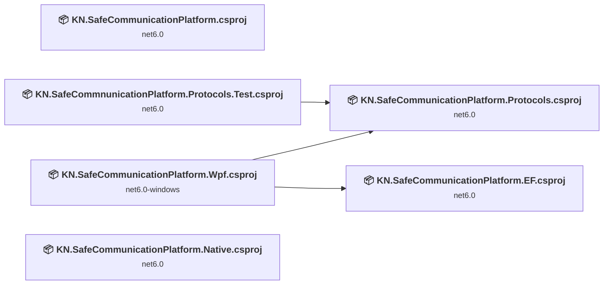
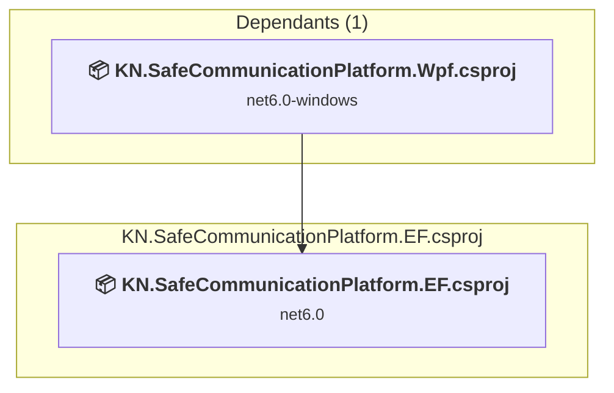
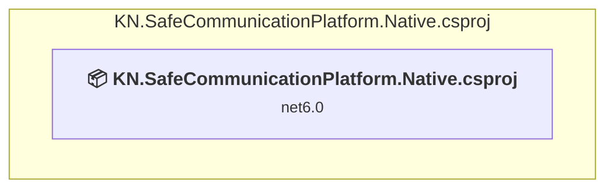
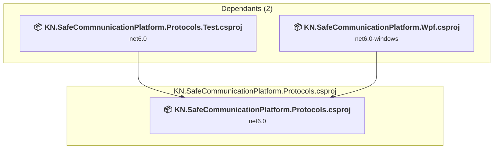
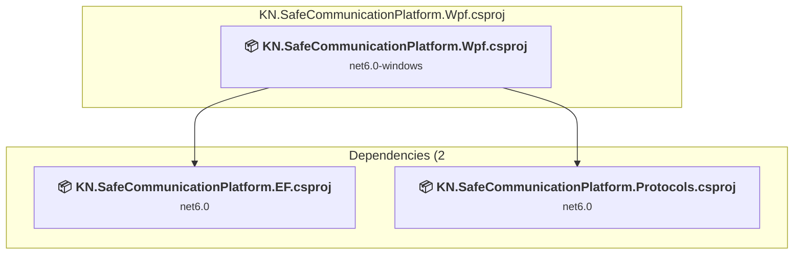
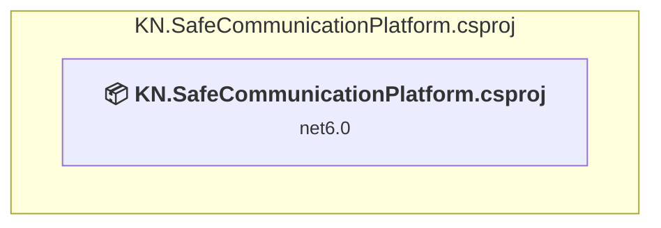
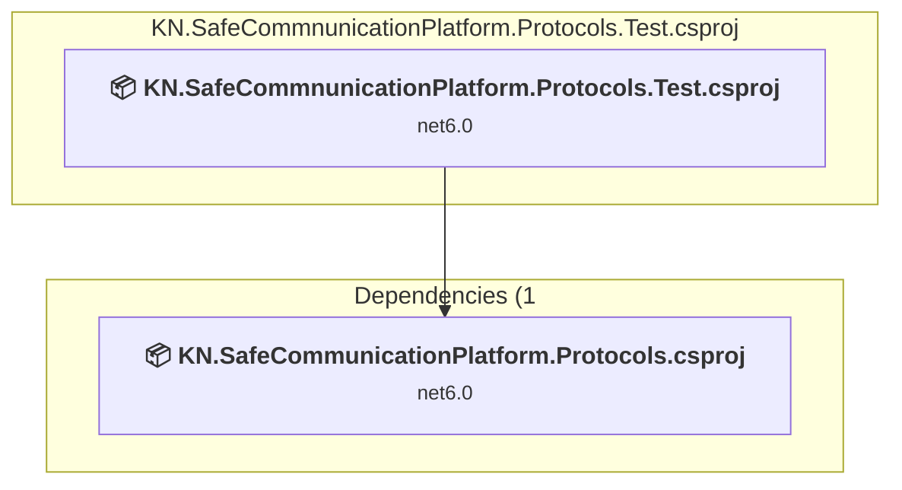

# Projects and dependencies analysis

This document provides a comprehensive overview of the projects and their dependencies in the context of upgrading to .NETCoreApp,Version=v10.0.

## Table of Contents

- [Executive Summary](#executive-Summary)
  - [Highlevel Metrics](#highlevel-metrics)
  - [Projects Compatibility](#projects-compatibility)
  - [Package Compatibility](#package-compatibility)
  - [API Compatibility](#api-compatibility)
- [Aggregate NuGet packages details](#aggregate-nuget-packages-details)
- [Top API Migration Challenges](#top-api-migration-challenges)
  - [Technologies and Features](#technologies-and-features)
  - [Most Frequent API Issues](#most-frequent-api-issues)
- [Projects Relationship Graph](#projects-relationship-graph)
- [Project Details](#project-details)

  - [src\KN.SafeCommunicationPlatform.EF\KN.SafeCommunicationPlatform.EF.csproj](#srcknsafecommunicationplatformefknsafecommunicationplatformefcsproj)
  - [src\KN.SafeCommunicationPlatform.Native\KN.SafeCommunicationPlatform.Native.csproj](#srcknsafecommunicationplatformnativeknsafecommunicationplatformnativecsproj)
  - [src\KN.SafeCommunicationPlatform.Protocols\KN.SafeCommunicationPlatform.Protocols.csproj](#srcknsafecommunicationplatformprotocolsknsafecommunicationplatformprotocolscsproj)
  - [src\KN.SafeCommunicationPlatform.Wpf\KN.SafeCommunicationPlatform.Wpf.csproj](#srcknsafecommunicationplatformwpfknsafecommunicationplatformwpfcsproj)
  - [src\KN.SafeCommunicationPlatform\KN.SafeCommunicationPlatform.csproj](#srcknsafecommunicationplatformknsafecommunicationplatformcsproj)
  - [test\KN.SafeCommnunicationPlatform.Protocols.Test\KN.SafeCommnunicationPlatform.Protocols.Test.csproj](#testknsafecommnunicationplatformprotocolstestknsafecommnunicationplatformprotocolstestcsproj)

## Executive Summary

### Highlevel Metrics

| Metric | Count | Status |
| :--- | :---: | :--- |
| Total Projects | 6 | All require upgrade |
| Total NuGet Packages | 23 | 7 need upgrade |
| Total Code Files | 48 |  |
| Total Code Files with Incidents | 15 |  |
| Total Lines of Code | 3190 |  |
| Total Number of Issues | 143 |  |
| Estimated LOC to modify | 130+ | at least 4.1% of codebase |

### Projects Compatibility

| Project | Target Framework | Difficulty | Package Issues | API Issues | Est. LOC Impact | Description |
| :--- | :---: | :---: | :---: | :---: | :---: | :--- |
| [src\KN.SafeCommunicationPlatform.EF\KN.SafeCommunicationPlatform.EF.csproj](#srcknsafecommunicationplatformefknsafecommunicationplatformefcsproj) | net6.0 | 🟢 Low | 2 | 0 |  | ClassLibrary, Sdk Style = True |
| [src\KN.SafeCommunicationPlatform.Native\KN.SafeCommunicationPlatform.Native.csproj](#srcknsafecommunicationplatformnativeknsafecommunicationplatformnativecsproj) | net6.0 | 🟢 Low | 0 | 0 |  | ClassLibrary, Sdk Style = True |
| [src\KN.SafeCommunicationPlatform.Protocols\KN.SafeCommunicationPlatform.Protocols.csproj](#srcknsafecommunicationplatformprotocolsknsafecommunicationplatformprotocolscsproj) | net6.0 | 🟢 Low | 1 | 0 |  | ClassLibrary, Sdk Style = True |
| [src\KN.SafeCommunicationPlatform.Wpf\KN.SafeCommunicationPlatform.Wpf.csproj](#srcknsafecommunicationplatformwpfknsafecommunicationplatformwpfcsproj) | net6.0-windows | 🟡 Medium | 2 | 129 | 129+ | Wpf, Sdk Style = True |
| [src\KN.SafeCommunicationPlatform\KN.SafeCommunicationPlatform.csproj](#srcknsafecommunicationplatformknsafecommunicationplatformcsproj) | net6.0 | 🟢 Low | 1 | 1 | 1+ | AspNetCore, Sdk Style = True |
| [test\KN.SafeCommnunicationPlatform.Protocols.Test\KN.SafeCommnunicationPlatform.Protocols.Test.csproj](#testknsafecommnunicationplatformprotocolstestknsafecommnunicationplatformprotocolstestcsproj) | net6.0 | 🟢 Low | 1 | 0 |  | DotNetCoreApp, Sdk Style = True |

### Package Compatibility

| Status | Count | Percentage |
| :--- | :---: | :---: |
| ✅ Compatible | 16 | 69.6% |
| ⚠️ Incompatible | 2 | 8.7% |
| 🔄 Upgrade Recommended | 5 | 21.7% |
| ***Total NuGet Packages*** | ***23*** | ***100%*** |

### API Compatibility

| Category | Count | Impact |
| :--- | :---: | :--- |
| 🔴 Binary Incompatible | 119 | High - Require code changes |
| 🟡 Source Incompatible | 1 | Medium - Needs re-compilation and potential conflicting API error fixing |
| 🔵 Behavioral change | 10 | Low - Behavioral changes that may require testing at runtime |
| ✅ Compatible | 3303 |  |
| ***Total APIs Analyzed*** | ***3433*** |  |

## Aggregate NuGet packages details

| Package | Current Version | Suggested Version | Projects | Description |
| :--- | :---: | :---: | :--- | :--- |
| CommunityToolkit.Mvvm | 8.0.0-preview1 |  | [KN.SafeCommunicationPlatform.Wpf.csproj](#srcknsafecommunicationplatformwpfknsafecommunicationplatformwpfcsproj) | ✅Compatible |
| coverlet.collector | 3.1.0 |  | [KN.SafeCommnunicationPlatform.Protocols.Test.csproj](#testknsafecommnunicationplatformprotocolstestknsafecommnunicationplatformprotocolstestcsproj) | ✅Compatible |
| KN.SafeCommunicationPlatform.Native | * |  | [KN.SafeCommunicationPlatform.Wpf.csproj](#srcknsafecommunicationplatformwpfknsafecommunicationplatformwpfcsproj) | ✅Compatible |
| Microsoft.EntityFrameworkCore.Sqlite | 6.0.2 | 10.0.8 | [KN.SafeCommunicationPlatform.EF.csproj](#srcknsafecommunicationplatformefknsafecommunicationplatformefcsproj) | 建议升级 NuGet 包 |
| Microsoft.EntityFrameworkCore.SqlServer | 6.0.2 | 10.0.8 | [KN.SafeCommunicationPlatform.EF.csproj](#srcknsafecommunicationplatformefknsafecommunicationplatformefcsproj) | 建议升级 NuGet 包 |
| Microsoft.Extensions.Configuration.Json | 6.0.0 | 10.0.8 | [KN.SafeCommunicationPlatform.Wpf.csproj](#srcknsafecommunicationplatformwpfknsafecommunicationplatformwpfcsproj) | 建议升级 NuGet 包 |
| Microsoft.NET.Test.Sdk | 16.11.0 |  | [KN.SafeCommnunicationPlatform.Protocols.Test.csproj](#testknsafecommnunicationplatformprotocolstestknsafecommnunicationplatformprotocolstestcsproj) | ✅Compatible |
| Microsoft.VisualStudio.Azure.Containers.Tools.Targets | 1.14.0 |  | [KN.SafeCommunicationPlatform.csproj](#srcknsafecommunicationplatformknsafecommunicationplatformcsproj) | ⚠️NuGet 包不兼容 |
| OpenCvSharp4.Windows | 4.5.5.20211231 |  | [KN.SafeCommunicationPlatform.Wpf.csproj](#srcknsafecommunicationplatformwpfknsafecommunicationplatformwpfcsproj) | ✅Compatible |
| OpenCvSharp4.WpfExtensions | 4.5.5.20211231 |  | [KN.SafeCommunicationPlatform.Wpf.csproj](#srcknsafecommunicationplatformwpfknsafecommunicationplatformwpfcsproj) | ✅Compatible |
| Pomelo.EntityFrameworkCore.MySql | 6.0.1 |  | [KN.SafeCommunicationPlatform.EF.csproj](#srcknsafecommunicationplatformefknsafecommunicationplatformefcsproj) | ✅Compatible |
| Serilog.AspNetCore | 5.0.0 |  | [KN.SafeCommunicationPlatform.Wpf.csproj](#srcknsafecommunicationplatformwpfknsafecommunicationplatformwpfcsproj) | ✅Compatible |
| Serilog.Extensions.Logging | 3.1.0 |  | [KN.SafeCommunicationPlatform.Wpf.csproj](#srcknsafecommunicationplatformwpfknsafecommunicationplatformwpfcsproj) | ✅Compatible |
| Serilog.Settings.Configuration | 3.3.0 |  | [KN.SafeCommunicationPlatform.Wpf.csproj](#srcknsafecommunicationplatformwpfknsafecommunicationplatformwpfcsproj) | ✅Compatible |
| Serilog.Sinks.File | 5.0.0 |  | [KN.SafeCommunicationPlatform.Wpf.csproj](#srcknsafecommunicationplatformwpfknsafecommunicationplatformwpfcsproj) | ✅Compatible |
| SkiaSharp.Views.WPF | 2.88.0-preview.187 |  | [KN.SafeCommunicationPlatform.Wpf.csproj](#srcknsafecommunicationplatformwpfknsafecommunicationplatformwpfcsproj) | ✅Compatible |
| System.Drawing.Common | 6.0.0 | 10.0.8 | [KN.SafeCommunicationPlatform.Wpf.csproj](#srcknsafecommunicationplatformwpfknsafecommunicationplatformwpfcsproj) | 建议升级 NuGet 包 |
| System.IO.Pipelines | 6.0.1 | 10.0.8 | [KN.SafeCommunicationPlatform.Protocols.csproj](#srcknsafecommunicationplatformprotocolsknsafecommunicationplatformprotocolscsproj) | 建议升级 NuGet 包 |
| xunit | 2.4.1 |  | [KN.SafeCommnunicationPlatform.Protocols.Test.csproj](#testknsafecommnunicationplatformprotocolstestknsafecommnunicationplatformprotocolstestcsproj) | ⚠️NuGet 包已弃用 |
| xunit.runner.visualstudio | 2.4.3 |  | [KN.SafeCommnunicationPlatform.Protocols.Test.csproj](#testknsafecommnunicationplatformprotocolstestknsafecommnunicationplatformprotocolstestcsproj) | ✅Compatible |
| ZXing.Net.Bindings.ImageSharp | 0.16.12 |  | [KN.SafeCommunicationPlatform.Protocols.csproj](#srcknsafecommunicationplatformprotocolsknsafecommunicationplatformprotocolscsproj) | ✅Compatible |
| ZXing.Net.Bindings.OpenCV.V4 | 0.16.8 |  | [KN.SafeCommunicationPlatform.Wpf.csproj](#srcknsafecommunicationplatformwpfknsafecommunicationplatformwpfcsproj) | ✅Compatible |
| ZXing.Net.Bindings.SkiaSharp | 0.16.12 |  | [KN.SafeCommunicationPlatform.Wpf.csproj](#srcknsafecommunicationplatformwpfknsafecommunicationplatformwpfcsproj) | ✅Compatible |

## Top API Migration Challenges

### Technologies and Features

| Technology | Issues | Percentage | Migration Path |
| :--- | :---: | :---: | :--- |
| WPF (Windows Presentation Foundation) | 52 | 40.0% | WPF APIs for building Windows desktop applications with XAML-based UI that are available in .NET on Windows. WPF provides rich desktop UI capabilities with data binding and styling. Enable Windows Desktop support: Option 1 (Recommended): Target net9.0-windows; Option 2: Add <UseWindowsDesktop>true</UseWindowsDesktop>. |

### Most Frequent API Issues

| API | Count | Percentage | Category |
| :--- | :---: | :---: | :--- |
| T:System.Windows.DependencyProperty | 13 | 10.0% | Binary Incompatible |
| T:System.Windows.Controls.TextBox | 11 | 8.5% | Binary Incompatible |
| T:System.Windows.Application | 8 | 6.2% | Binary Incompatible |
| T:System.Windows.RoutedEventHandler | 8 | 6.2% | Binary Incompatible |
| T:System.Windows.Controls.TextBlock | 7 | 5.4% | Binary Incompatible |
| T:System.Uri | 5 | 3.8% | Behavioral Change |
| M:System.Windows.DependencyObject.SetValue(System.Windows.DependencyProperty,System.Object) | 5 | 3.8% | Binary Incompatible |
| P:System.Windows.Controls.TextBox.Text | 5 | 3.8% | Binary Incompatible |
| P:System.Windows.Controls.TextBlock.Text | 5 | 3.8% | Binary Incompatible |
| M:System.Uri.#ctor(System.String,System.UriKind) | 4 | 3.1% | Behavioral Change |
| M:System.Windows.DependencyObject.GetValue(System.Windows.DependencyProperty) | 4 | 3.1% | Binary Incompatible |
| T:System.Windows.Threading.Dispatcher | 4 | 3.1% | Binary Incompatible |
| P:System.Windows.Threading.DispatcherObject.Dispatcher | 4 | 3.1% | Binary Incompatible |
| M:System.Windows.Window.#ctor | 4 | 3.1% | Binary Incompatible |
| M:System.Windows.Application.LoadComponent(System.Object,System.Uri) | 3 | 2.3% | Binary Incompatible |
| T:System.Windows.Markup.IComponentConnector | 3 | 2.3% | Binary Incompatible |
| T:System.Windows.Controls.Image | 3 | 2.3% | Binary Incompatible |
| M:System.Windows.Controls.UserControl.#ctor | 2 | 1.5% | Binary Incompatible |
| M:System.Windows.Threading.Dispatcher.Invoke(System.Action) | 2 | 1.5% | Binary Incompatible |
| T:System.Windows.MessageBox | 2 | 1.5% | Binary Incompatible |
| T:System.Windows.MessageBoxResult | 2 | 1.5% | Binary Incompatible |
| M:System.Windows.MessageBox.Show(System.String) | 2 | 1.5% | Binary Incompatible |
| E:System.Windows.FrameworkElement.Loaded | 2 | 1.5% | Binary Incompatible |
| P:System.Windows.Application.Current | 2 | 1.5% | Binary Incompatible |
| P:System.Windows.FrameworkElement.DataContext | 2 | 1.5% | Binary Incompatible |
| T:System.Windows.Window | 2 | 1.5% | Binary Incompatible |
| E:System.Windows.Controls.Primitives.ButtonBase.Click | 2 | 1.5% | Binary Incompatible |
| T:System.Windows.RoutedEventArgs | 2 | 1.5% | Binary Incompatible |
| M:Microsoft.AspNetCore.Builder.ExceptionHandlerExtensions.UseExceptionHandler(Microsoft.AspNetCore.Builder.IApplicationBuilder,System.String) | 1 | 0.8% | Behavioral Change |
| T:System.Windows.Controls.UserControl | 1 | 0.8% | Binary Incompatible |
| M:System.Windows.UIElement.InvalidateVisual | 1 | 0.8% | Binary Incompatible |
| M:System.TimeSpan.FromMinutes(System.Double) | 1 | 0.8% | Source Incompatible |
| M:System.Windows.Application.Run | 1 | 0.8% | Binary Incompatible |
| P:System.Windows.Application.StartupUri | 1 | 0.8% | Binary Incompatible |
| T:System.Windows.StartupEventArgs | 1 | 0.8% | Binary Incompatible |
| M:System.Windows.Application.OnStartup(System.Windows.StartupEventArgs) | 1 | 0.8% | Binary Incompatible |
| M:System.Windows.Application.#ctor | 1 | 0.8% | Binary Incompatible |
| T:System.Windows.Media.Imaging.WriteableBitmap | 1 | 0.8% | Binary Incompatible |
| T:System.Windows.Media.ImageSource | 1 | 0.8% | Binary Incompatible |
| P:System.Windows.Controls.Image.Source | 1 | 0.8% | Binary Incompatible |

## Projects Relationship Graph

Legend:
📦 SDK-style project
⚙️ Classic project

## Project Details

### src\KN.SafeCommunicationPlatform.EF\KN.SafeCommunicationPlatform.EF.csproj

#### Project Info

- **Current Target Framework:** net6.0
- **Proposed Target Framework:** net10.0
- **SDK-style**: True
- **Project Kind:** ClassLibrary
- **Dependencies**: 0
- **Dependants**: 1
- **Number of Files**: 5
- **Number of Files with Incidents**: 1
- **Lines of Code**: 205
- **Estimated LOC to modify**: 0+ (at least 0.0% of the project)

#### Dependency Graph

Legend:
📦 SDK-style project
⚙️ Classic project

### API Compatibility

| Category | Count | Impact |
| :--- | :---: | :--- |
| 🔴 Binary Incompatible | 0 | High - Require code changes |
| 🟡 Source Incompatible | 0 | Medium - Needs re-compilation and potential conflicting API error fixing |
| 🔵 Behavioral change | 0 | Low - Behavioral changes that may require testing at runtime |
| ✅ Compatible | 155 |  |
| ***Total APIs Analyzed*** | ***155*** |  |

### src\KN.SafeCommunicationPlatform.Native\KN.SafeCommunicationPlatform.Native.csproj

#### Project Info

- **Current Target Framework:** net6.0
- **Proposed Target Framework:** net10.0
- **SDK-style**: True
- **Project Kind:** ClassLibrary
- **Dependencies**: 0
- **Dependants**: 0
- **Number of Files**: 3
- **Number of Files with Incidents**: 1
- **Lines of Code**: 154
- **Estimated LOC to modify**: 0+ (at least 0.0% of the project)

#### Dependency Graph

Legend:
📦 SDK-style project
⚙️ Classic project

### API Compatibility

| Category | Count | Impact |
| :--- | :---: | :--- |
| 🔴 Binary Incompatible | 0 | High - Require code changes |
| 🟡 Source Incompatible | 0 | Medium - Needs re-compilation and potential conflicting API error fixing |
| 🔵 Behavioral change | 0 | Low - Behavioral changes that may require testing at runtime |
| ✅ Compatible | 76 |  |
| ***Total APIs Analyzed*** | ***76*** |  |

### src\KN.SafeCommunicationPlatform.Protocols\KN.SafeCommunicationPlatform.Protocols.csproj

#### Project Info

- **Current Target Framework:** net6.0
- **Proposed Target Framework:** net10.0
- **SDK-style**: True
- **Project Kind:** ClassLibrary
- **Dependencies**: 0
- **Dependants**: 2
- **Number of Files**: 21
- **Number of Files with Incidents**: 1
- **Lines of Code**: 1872
- **Estimated LOC to modify**: 0+ (at least 0.0% of the project)

#### Dependency Graph

Legend:
📦 SDK-style project
⚙️ Classic project

### API Compatibility

| Category | Count | Impact |
| :--- | :---: | :--- |
| 🔴 Binary Incompatible | 0 | High - Require code changes |
| 🟡 Source Incompatible | 0 | Medium - Needs re-compilation and potential conflicting API error fixing |
| 🔵 Behavioral change | 0 | Low - Behavioral changes that may require testing at runtime |
| ✅ Compatible | 1368 |  |
| ***Total APIs Analyzed*** | ***1368*** |  |

### src\KN.SafeCommunicationPlatform.Wpf\KN.SafeCommunicationPlatform.Wpf.csproj

#### Project Info

- **Current Target Framework:** net6.0-windows
- **Proposed Target Framework:** net10.0-windows
- **SDK-style**: True
- **Project Kind:** Wpf
- **Dependencies**: 2
- **Dependants**: 0
- **Number of Files**: 7
- **Number of Files with Incidents**: 9
- **Lines of Code**: 610
- **Estimated LOC to modify**: 129+ (at least 21.1% of the project)

#### Dependency Graph

Legend:
📦 SDK-style project
⚙️ Classic project

### API Compatibility

| Category | Count | Impact |
| :--- | :---: | :--- |
| 🔴 Binary Incompatible | 119 | High - Require code changes |
| 🟡 Source Incompatible | 1 | Medium - Needs re-compilation and potential conflicting API error fixing |
| 🔵 Behavioral change | 9 | Low - Behavioral changes that may require testing at runtime |
| ✅ Compatible | 634 |  |
| ***Total APIs Analyzed*** | ***763*** |  |

#### Project Technologies and Features

| Technology | Issues | Percentage | Migration Path |
| :--- | :---: | :---: | :--- |
| WPF (Windows Presentation Foundation) | 52 | 40.3% | WPF APIs for building Windows desktop applications with XAML-based UI that are available in .NET on Windows. WPF provides rich desktop UI capabilities with data binding and styling. Enable Windows Desktop support: Option 1 (Recommended): Target net9.0-windows; Option 2: Add <UseWindowsDesktop>true</UseWindowsDesktop>. |

### src\KN.SafeCommunicationPlatform\KN.SafeCommunicationPlatform.csproj

#### Project Info

- **Current Target Framework:** net6.0
- **Proposed Target Framework:** net10.0
- **SDK-style**: True
- **Project Kind:** AspNetCore
- **Dependencies**: 0
- **Dependants**: 0
- **Number of Files**: 18
- **Number of Files with Incidents**: 2
- **Lines of Code**: 193
- **Estimated LOC to modify**: 1+ (at least 0.5% of the project)

#### Dependency Graph

Legend:
📦 SDK-style project
⚙️ Classic project

### API Compatibility

| Category | Count | Impact |
| :--- | :---: | :--- |
| 🔴 Binary Incompatible | 0 | High - Require code changes |
| 🟡 Source Incompatible | 0 | Medium - Needs re-compilation and potential conflicting API error fixing |
| 🔵 Behavioral change | 1 | Low - Behavioral changes that may require testing at runtime |
| ✅ Compatible | 985 |  |
| ***Total APIs Analyzed*** | ***986*** |  |

### test\KN.SafeCommnunicationPlatform.Protocols.Test\KN.SafeCommnunicationPlatform.Protocols.Test.csproj

#### Project Info

- **Current Target Framework:** net6.0
- **Proposed Target Framework:** net10.0
- **SDK-style**: True
- **Project Kind:** DotNetCoreApp
- **Dependencies**: 1
- **Dependants**: 0
- **Number of Files**: 5
- **Number of Files with Incidents**: 1
- **Lines of Code**: 156
- **Estimated LOC to modify**: 0+ (at least 0.0% of the project)

#### Dependency Graph

Legend:
📦 SDK-style project
⚙️ Classic project

### API Compatibility

| Category | Count | Impact |
| :--- | :---: | :--- |
| 🔴 Binary Incompatible | 0 | High - Require code changes |
| 🟡 Source Incompatible | 0 | Medium - Needs re-compilation and potential conflicting API error fixing |
| 🔵 Behavioral change | 0 | Low - Behavioral changes that may require testing at runtime |
| ✅ Compatible | 85 |  |
| ***Total APIs Analyzed*** | ***85*** |  |

